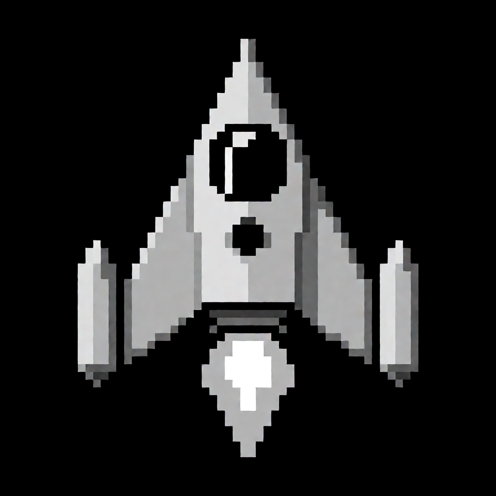

# Playground Inference

## Text Generation
[llama.cpp](https://github.com/ggml-org/llama.cpp) server tuned for agentic flow on AMD Radeon RX 9060 XT 16GB

### Run Server
```
nix develop

rocm-server
```

### Connect pi or other agent using `http://127.0.0.1:8080/v1`

## Image Generation
```
nix develop

SD_MODEL=Krea2-Turbo generate "Top-down view pixel art retro Asteroids game spaceship sprite"
```

