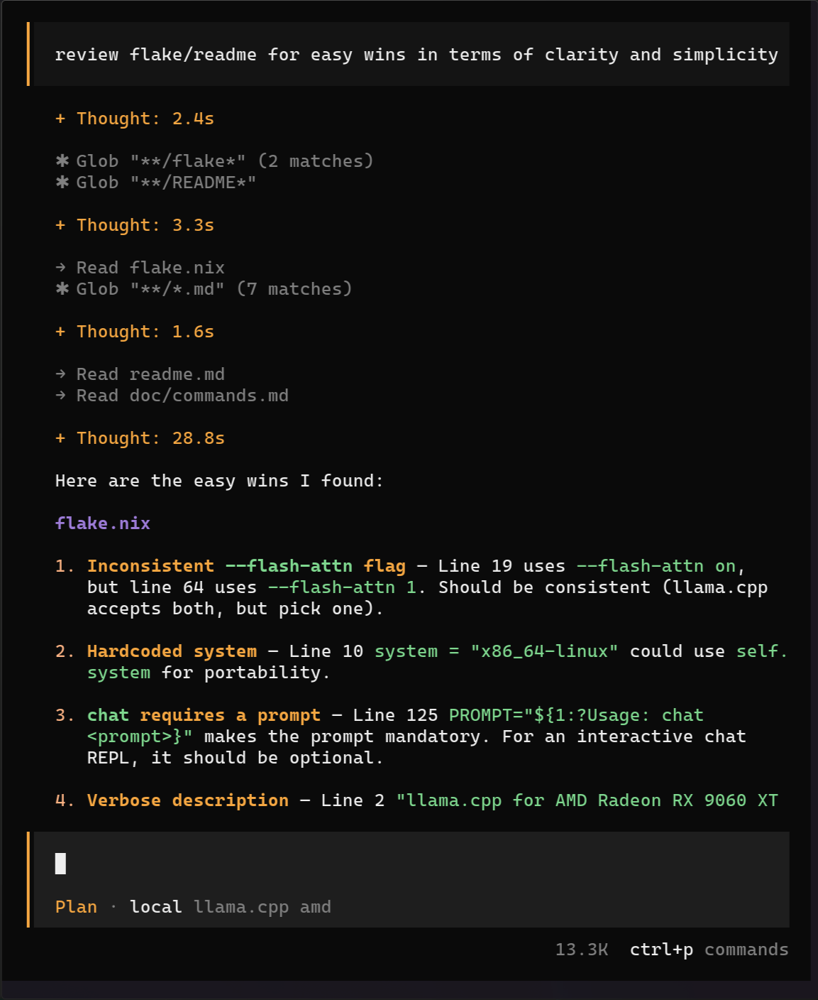

# Playground Inference
[llama.cpp](https://github.com/ggml-org/llama.cpp) server tuned for agentic flow on AMD Radeon RX 9060 XT 16GB

## Quick start
### Run Server
```
nix develop

download-model https://huggingface.co/unsloth/Qwen3.6-27B-MTP-GGUF/resolve/main/Qwen3.6-27B-Q3_K_M.gguf

MODEL=Qwen3.6-27B-Q3_K_M.gguf rocm-server
```

### Connect opencode or other agent using `http://127.0.0.1:8080/v1`
```
nvim ~/.config/opencode.json
```
```json
{
  "$schema": "https://opencode.ai/config.json",
  "provider": {
    "llama.cpp": {
      "npm": "@ai-sdk/openai-compatible",
      "name": "llama.cpp amd",
      "options": {
        "baseURL": "http://127.0.0.1:8080/v1"
      },
      // NOTE: llama.cpp server loads one model per process.
      // The model field in your API request is ignored; it always serves whatever it was started with.
      "models": {
        "local": {
          "name": "local"
        }
      }
    }
  },
  // NOTE: keep free cloud provider as default
  "model": "opencode/big-pickle"
}
```

[](https://github.com/anomalyco/opencode)
